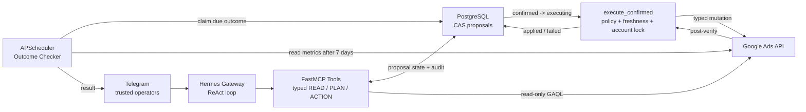

# HERMES 3.0 | Agile Agent Architecture for Google Ads

> Private, safety-gated AI agent for operating Google Ads through Telegram, FastMCP and PostgreSQL.


HERMES 3.0 принимает свободный запрос в Telegram, самостоятельно выбирает typed-инструменты,
читает и анализирует Google Ads, готовит единый план изменений и передаёт денежные мутации через
детерминированный confirm/CAS-контур. Модель отвечает за рассуждение и порядок действий; Python-код —
за identity, policy, freshness, account ceiling, audit и проверяемое исполнение.

> **Release status:** репозиторий готовится к `v3.0.0`. Наличие этой документации само по себе не
> подтверждает production cutover, успешный backup или создание тега.

## Why Hermes 3.0?

Классический Telegram-бот строит диалог как заранее заданный граф: aiogram FSM диктует следующий
экран, а LangGraph требует заранее моделировать узлы и переходы. Для агентского управления рекламой
это создаёт хрупкий второй оркестратор: новый сценарий требует новых state/edge, даже когда Hermes уже
умеет понять намерение и выбрать tool.

В HERMES 3.0 production-оркестрация перенесена в легковесный ReAct-контур Hermes Gateway:

- пользователь формулирует цель естественным языком;
- Hermes выбирает инструменты, порядок анализа и размер пакета;
- FastMCP предоставляет узкие typed primitives вместо доступа модели к Google Ads SDK;
- критические границы остаются в детерминированном коде, а не в prompt или графе агента.

В HERMES 3.0 legacy-контур aiogram/FSM удалён после создания release backup и стабильного тега.
Telegram обслуживает Hermes Gateway, а фоновые уведомления отправляет минимальный HTTP-транспорт.

## Key Features

### Bias for Action

Hermes не заставляет оператора копировать ID или проходить wizard, если объект можно однозначно
разрешить из контекста. Связанные изменения объединяются в один proposal и одну карточку
подтверждения; неоднозначный выбор возвращается оператору компактно.

### Self-Healing GAQL

READ-инструменты возвращают структурированный envelope: стабильный `error_code`, безопасное описание
ошибки и recovery hint. ReAct-контур может исправить GAQL, сузить период или повторить чтение, не
получая сырой exception и не обходя account/read policy.

### Trusted Transport & CAS Mutations

Telegram actor/chat/reply context поступает из trusted transport, а не из аргументов модели.
Proposal привязан к полному diff и проходит одноразовый compare-and-swap переход. Повторный callback,
устаревшая карточка, чужой actor, drift состояния или неверный account приводят к fail-closed отказу.
Сообщение «выполнено» формируется только после audit-row и post-verify.

### Continuous Learning

Для поддерживаемых применённых изменений сохраняется outcome context. Read-only Outcome Checker через
настраиваемое окно (по умолчанию 7 дней) сравнивает метрики до/после, вычисляет verdict кодом и
доставляет результат оператору. Фоновая задача не выполняет Google Ads mutations.

## Architecture



### MCP surface

Текущий проверяемый registry содержит **84 инструмента**:

| Surface | Count | Responsibility |
|---|---:|---|
| READ | 25 | Google Ads reads, audits, reports and discovery |
| META | 1 | Trusted bridge capability discovery |
| PLAN/state | 15 | Proposal, workflow and memory state |
| Actions | 42 | Прямые agent-first action names; mutation либо исполняется по policy, либо готовит proposal |
| Approval execute | 1 | `execute_confirmed` — единственная точка исполнения подтверждённого proposal |

Итого: **25 READ-инструментов + 1 META + 57 agent-first PLAN/action/state + 1 approval execute**.
Фактический FastMCP registry сверяется на точное равенство при старте.

## Safety Model

- Telegram allowlist fail-closed: пустой список не открывает доступ никому.
- Любая неизвестная операция считается требующей подтверждения.
- Budget/bid принимаются только из текущего доверенного человеческого хода.
- Confirmation — одноразовый CAS, привязанный к actor, chat, message и полному diff.
- Freshness, account ceiling, kill switch, typed validation и quota не обходятся моделью.
- Hermes не вызывает Google Ads SDK напрямую; SDK доступен только typed Python execution layer.
- Секреты не попадают в prompt, Telegram, логи или Git.

Каноническая классификация операций находится в [`confirm/policy.py`](confirm/policy.py).

## Quick Start

### Requirements

- Docker Engine with Docker Compose v2;
- Git;
- учётные данные Google Ads и Telegram/Hermes для полноценного runtime;
- минимум два сильных пароля для PostgreSQL ролей.

### Start the core services

```bash
git clone <repository-url> aimash
cd aimash
cp .env.example .env
# Заполните POSTGRES_PASSWORD, POSTGRES_RO_PASSWORD и остальные обязательные credentials.
docker compose config --quiet
docker compose up -d --build
docker compose ps
```

Команда поднимает PostgreSQL, применяет Alembic migrations, запускает scheduler и локальный backup
sidecar. Hermes Gateway работает на host и запускает ephemeral MCP-процесс по stdio; его установка и
проверка описаны в [`deploy/hermes/README.md`](deploy/hermes/README.md) и
[`deploy/hermes/OPERATIONS.md`](deploy/hermes/OPERATIONS.md).

Для локальной проверки Python-контура:

```bash
python -m venv .venv
source .venv/bin/activate
pip install -e ".[dev]"
python -m pytest
```

На Windows активируйте окружение командой `.venv\Scripts\Activate.ps1`.

## Release Backup

После коммита релизного состояния запустите:

```bash
bash scripts/create_release_backup.sh
```

Скрипт проверяет контейнер PostgreSQL, создаёт custom-format dump схемы и данных, валидирует его через
`pg_restore --list`, затем атомарно пишет `backups/release_v3.0.0_YYYYMMDD.tar.gz`. Архив получает
права `0600` и может содержать production data и локальные секреты: храните его зашифрованным и вне
основного сервера. Скрипт только печатает команды tag/push — он не выполняет их автоматически.

## Repository Layout

```text
ads/             Google Ads readers, typed mutations and freshness gates
confirm/         policy, proposal lifecycle, CAS and audit
mcp_server/      FastMCP registry, trusted transport and structured envelopes
clients/         account-scoped profiles, crawl and Aimash Memory
reports/         XLSX, PDF, Google Sheets and Telegram-ready reports
scheduler/       read/notify/cleanup jobs and Outcome Checker
deploy/hermes/   gateway configuration, SOUL, runbooks and operations
scripts/         verification, migration and release utilities
```

## Contract and Documentation

Единственный договорный канон — три оригинальных документа заказчика:

- [`Aimash_Technical_Specification.docx`](Aimash_Technical_Specification.docx)
- [`Aimash_Flow_Google_Search_4.docx`](Aimash_Flow_Google_Search_4.docx)
- [`Информация о клиентах_1.docx`](Информация%20о%20клиентах_1.docx)

[`ТЗ.md`](ТЗ.md) — их проверяемое текстовое зеркало. Engineering-документы и runbooks — производные
implementation notes и при расхождении исправляются по исходным DOCX.

Живые эксплуатационные документы:

- [`docs/ARCHITECTURE.md`](docs/ARCHITECTURE.md) — Trusted Transport, proposal CAS и Outcome Checker.
- [`docs/MCP_TOOLS.md`](docs/MCP_TOOLS.md) — проверяемый registry 84 FastMCP tools.
- [`docs/MEMORY_AND_SOUL.md`](docs/MEMORY_AND_SOUL.md) — Aimash Memory, crawler и правила SOUL.
- [`docs/research_archive.md`](docs/research_archive.md) — feature-gated архив публичных научных источников и его откат.
- [`docs/CLIENT_HANDOFF_RUNBOOK.md`](docs/CLIENT_HANDOFF_RUNBOOK.md) — передача VPS, secrets и production readiness.
- [`deploy/hermes/README.md`](deploy/hermes/README.md) — установка и топология.
- [`deploy/hermes/OPERATIONS.md`](deploy/hermes/OPERATIONS.md) — deploy и runtime verification.
- [`deploy/hermes/SAFE_RESTART.md`](deploy/hermes/SAFE_RESTART.md) — безопасный restart.
- [`deploy/hermes/host-a/RUNBOOK.md`](deploy/hermes/host-a/RUNBOOK.md) — host runbook.
- [`deploy/hermes/SOUL.md`](deploy/hermes/SOUL.md) — системные инструкции и Bias for Action.
- [`deploy/hermes/skills/ad-master/creative-director/SKILL.md`](deploy/hermes/skills/ad-master/creative-director/SKILL.md) — creative-director workflow Hermes.
- [`deploy/hermes/DRIFT_AUDIT.md`](deploy/hermes/DRIFT_AUDIT.md) — контроль дрейфа tool surface.
- [`deploy/hermes/RISK_REGISTER.md`](deploy/hermes/RISK_REGISTER.md) — открытые риски.
- [`deploy/hermes/OPEN_DECISIONS.md`](deploy/hermes/OPEN_DECISIONS.md) — операционные решения.
- [`deploy/hermes/skills/ad-master/ad-master-agent/SKILL.md`](deploy/hermes/skills/ad-master/ad-master-agent/SKILL.md) — skill аудита и исследования.
- [`deploy/hermes/skills/ad-master/google-ads-worker/SKILL.md`](deploy/hermes/skills/ad-master/google-ads-worker/SKILL.md) — Google Ads worker skill.

## License

Private project. No open-source license has been granted. Do not copy, redistribute or deploy outside
the authorized environment without the owner's written permission.
