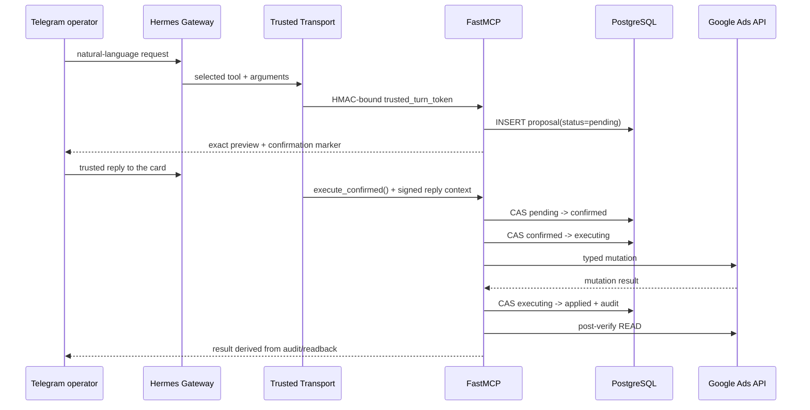
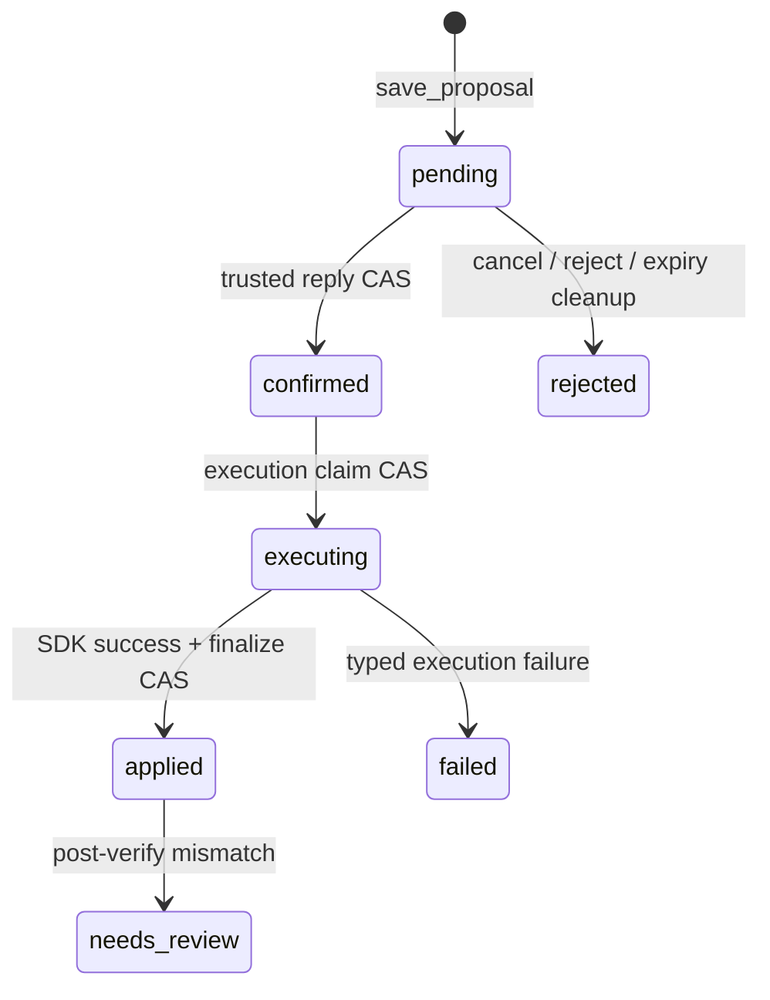

# HERMES 3.0 Architecture

HERMES 3.0 разделяет агентское рассуждение и право на изменение состояния. Hermes Gateway ведёт
ReAct-цикл и выбирает MCP-инструменты, но identity, proposal lifecycle, CAS, Google Ads mutation,
audit и post-verification выполняются детерминированным Python-кодом.

## Компоненты

| Компонент | Ответственность | Не делает |
|---|---|---|
| Hermes Gateway | Понимает цель, выбирает tools, собирает контекст | Не вызывает Google Ads SDK напрямую |
| Trusted Transport | Подписывает Telegram actor/reply context и точные аргументы MCP-вызова | Не принимает identity от модели |
| FastMCP READ | Читает Google Ads и локальное состояние | Не создаёт mutations |
| FastMCP PLAN & STATE | Управляет proposals, incidents, decisions и durable workflows | Не исполняет Google Ads proposal |
| FastMCP ACTION | Валидирует действие и создаёт `pending` proposal | Не обходит `confirm/policy.py` |
| PostgreSQL | Хранит proposal, CAS-status, audit и outcome state | Не полагается на in-memory lock |
| APScheduler | Выполняет read/notify/cleanup jobs и Outcome Checker | Не выполняет Google Ads mutations |



## Trusted Transport

Обычные MCP-аргументы видимы модели, поэтому `actor_user_id`, `actor_chat_id`, Telegram
`message_id` и reply anchor не считаются доверенными, если пришли как tool arguments. Gateway hook
добавляет `trusted_turn_token` после формирования вызова моделью; сервер проверяет токен в
[`mcp_server/trusted_transport.py`](../mcp_server/trusted_transport.py).

Токен HMAC-SHA256 связан со следующим контекстом:

| Поле | Зачем проверяется |
|---|---|
| `platform=telegram` | Запрещает использовать metadata другого transport |
| exact MCP tool name | Токен одного инструмента нельзя повторить для другого |
| SHA-256 canonical arguments | Модель или wrapper не могут изменить аргументы после hook |
| `iat` / `exp` | Короткоживущий токен нельзя переиспользовать позже |
| actor/chat/message | Identity и namespace берутся из Telegram event |
| reply message + marker | Подтверждение относится к конкретной карточке и полному preview |

Если подпись, TTL, имя tool или digest не совпали, PLAN/WRITE-вызов завершается fail-closed. Google
OAuth credentials остаются вне Hermes Gateway.

## Создание proposal

[`mcp_server/tools_plan.py`](../mcp_server/tools_plan.py) и
[`mcp_server/tools_write.py`](../mcp_server/tools_write.py) имеют разные роли:

- `tools_plan.py` публикует durable state: просмотр/отмена proposal, incidents, decisions, artifacts
  и memory workflows. `profile_change`, `profile_clear` и `start_client_crawl` создают proposal на
  изменение Aimash Memory, но не Google Ads mutation;
- `tools_write.py` публикует 42 ACTION tools и отдельный `composite_change`. Каждый ACTION валидирует
  typed payload; composite объединяет 2–10 rollbackable операций в один parent proposal;
- [`mcp_server/propose.py`](../mcp_server/propose.py) снимает текущий state, строит точный
  `before -> after` preview и сохраняет строку через `ConfirmStore.save_proposal()`;
- новая строка всегда получает `status="pending"`. PostgreSQL partial unique index допускает не
  более одного unresolved proposal на один trusted human run.

Упрощённая форма строки:

```text
proposals
├── confirmation_id  unique immutable id
├── operation        exact typed operation
├── customer_id      authoritative execution account
├── params            validated payload + attested before-state
├── summary           immutable user-visible diff
├── chat_id           Telegram message namespace
├── author_user_id    trusted human identity
├── tg_message_id     exact confirmation-card anchor
├── status            pending|confirmed|executing|applied|failed|...
└── outcome_*         delayed result measurement state
```

Policy применяется после сохранения proposal. Операция, которой разрешено немедленное выполнение из
текущего trusted human turn, атомарно подтверждается кодом и проходит тот же execution path. Операция,
требующая согласия, возвращает `APPROVAL_REQUIRED`, неизменяемый preview и остаётся `pending`.

## Proposal CAS lifecycle



### `pending -> confirmed`

`execute_confirmed` намеренно не принимает `account` или `confirmation_id` от модели. Он извлекает
marker и reply metadata из проверенного trusted turn, проверяет неизменённый summary и вызывает
`ConfirmStore.confirm_by_reply()`.

Authoritative переход — один SQL `UPDATE ... WHERE`:

```sql
UPDATE proposals
SET status = 'confirmed', decided_at = now()
WHERE confirmation_id = :confirmation_id
  AND status = 'pending'
  AND chat_id = :actor_chat_id
  AND tg_message_id IS NOT NULL
  AND tg_message_id = :reply_to_message_id
  AND author_user_id IS NOT NULL
  AND author_user_id = :actor_user_id
  AND created_at >= :ttl_boundary;
```

Успех существует только при `rowcount = 1`. Повторный callback, чужой actor, другой message,
просроченный proposal или параллельный победитель дают `rowcount = 0`; SDK не вызывается.

### `confirmed -> executing`

Перед claim execution layer повторно проверяет operation, account ceiling и live freshness. Затем
`ConfirmStore.claim()` выполняет CAS:

```sql
UPDATE proposals
SET status = 'executing', decided_at = now()
WHERE confirmation_id = :confirmation_id
  AND operation = :operation
  AND status = 'confirmed'
  AND created_at >= :ttl_boundary;
```

В реальном запросе также присутствуют risk-tier/four-eyes условия. Только один worker получает
`rowcount = 1`; остальные не могут выполнить mutation повторно.

### `executing -> applied`

Typed handler вызывает Google Ads SDK. После успешного ответа `ConfirmStore.finalize()` переводит
только строку `executing` в `applied` и в той же транзакции добавляет `audit_log` row. Затем
`execute_confirmed` выполняет read-only post-verification. Расхождение ожидаемого и фактического
state переводит результат в `needs_review`; оно не маскируется текстом модели.

## Outcome Checker

Для поддерживаемых операций `finalize()` фиксирует outcome context одновременно с `applied`:

```text
proposal.status = applied
proposal.outcome_state = pending
proposal.outcome_due_at = applied_at + OUTCOME_CHECK_DAYS
```

`OUTCOME_CHECK_DAYS` по умолчанию равен 7 и ограничивается кодом. APScheduler запускает
`run_outcome_checker` по cron (`OUTCOME_CHECK_SCHEDULE`, по умолчанию ежедневно).

```mermaid
stateDiagram-v2
    [*] --> pending: mutation applied; due_at = +7 days
    pending --> checking: atomic scheduler claim
    checking --> delivered: metrics read + Telegram delivery + terminal CAS
    checking --> pending: retry next day
    checking --> failed: max attempts reached
    checking --> pending: stale claim recovery after 1 hour
```



Алгоритм:

1. `claim_due_outcomes()` выбирает только `status=applied`, `outcome_state=pending` и
   `outcome_due_at <= now`.
2. Каждый candidate отдельно получает CAS `pending -> checking`; это исключает двойную доставку при
   нескольких scheduler workers.
3. Checker читает Google Ads metrics до/после окна и вычисляет delta/verdict кодом.
4. Сообщение отправляется исходному Telegram chat.
5. Только после успешной доставки `complete_outcome()` выполняет CAS `checking -> delivered` и
   сохраняет ограниченный `outcome_result`.
6. Ошибка освобождает claim на следующий день. После максимума попыток состояние становится
   `failed`; зависший `checking` старше часа возвращается в `pending`.

Outcome Checker остаётся read/notify-контуром: он не создаёт proposal и не вызывает Google Ads
mutation.

## Инварианты

- модель выбирает действие, но не поставляет trusted identity;
- account исполнения берётся из сохранённого proposal;
- TTL входит в CAS, а scheduler cleanup не является authorization boundary;
- `rowcount == 1` — обязательное доказательство владения переходом;
- `applied` подтверждается audit и post-readback, а не текстом агента;
- Google Ads и Aimash Memory используют один confirmation lifecycle, но разные typed executors.
