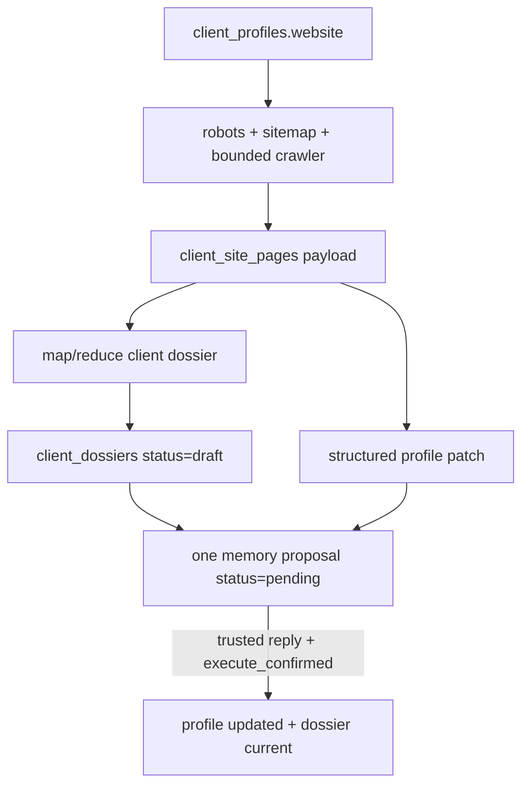

# Aimash Memory & HERMES SOUL

Aimash Memory хранит долговечные account-scoped факты клиента и правила менеджера. Это не копия
истории чата и не кэш Google Ads metrics: профиль переживает новые сессии, а volatile performance
state всегда перечитывается live READ tools.

## Модель данных

| Сущность | Таблица | Содержимое |
|---|---|---|
| Client profile | `client_profiles` | Бренд, описание, география, язык, website, socials, notes |
| Contacts | `client_contacts` | Телефоны, email, адреса и social/messenger contacts |
| Services | `client_services` | Услуги/товары, описания, отображаемые цены, категории |
| Site pages | `client_site_pages` | URL, title, page type, content hash и ограниченный page text |
| Dossier | `client_dossiers` | Версионированный site-wide JSON, owner Markdown и PII-free LLM context |
| Crawl jobs | `crawl_jobs` | `running -> done/failed`, domain, mode и pages count |
| Profile history | `client_profile_history` | Снимок профиля до save/update/clear для audit/rollback |

Ключ изоляции — `customer_id`: один аккаунт не наследует правила, факты или досье другого клиента.

## Что хранить, а что читать live

| Durable Aimash Memory | Только live READ |
|---|---|
| Brand, services, geography, audience language | Spend, clicks, conversions, CPA |
| Stable business constraints | Campaign/ad/keyword status |
| KPI и правила менеджера | Current budgets and bids |
| Ad-copy style и запрещённые формулировки | Quota, policy status, account changes |
| Website-derived stable facts | Любой state, который мог измениться после сохранения |

Гипотезы, случайные выводы модели и transient metrics не становятся memory facts без явного
подтверждённого изменения профиля.

## `start_client_crawl`

Crawler использует URL, уже сохранённый в профиле выбранного аккаунта. Произвольный URL из аргумента
модели не становится источником памяти.



Последовательность:

1. Проверяется наличие корректного `http/https` website в текущем профиле.
2. Создаётся наблюдаемый `crawl_jobs` row.
3. Crawler учитывает robots/sitemap и ограничивается configured pages, depth, concurrency, text и
   time budget.
4. Страницы нормализуются; incremental mode сравнивает content hashes.
5. Из полной карты сайта строится dossier. Owner Markdown может содержать контакты, а
   `llm_context` рендерится без PII.
6. Досье сохраняется как `draft`, профиль ещё не изменяется.
7. `start_client_crawl` создаёт один `profile_save`/`profile_update` proposal с
   `memory_status=pending_confirmation`.
8. Только trusted reply и `execute_confirmed()` применяют patch и переводят точное dossier из
   `draft` в `current`.

Если incremental crawl не обнаружил новых или изменённых страниц, он возвращает `unchanged` и не
создаёт фиктивное изменение памяти.

## Memory mutations

| Tool | Результат до подтверждения |
|---|---|
| `profile_change(account, text)` | Структурирует stable facts/rules и создаёт один `pending` save/update proposal |
| `profile_clear(account)` | Создаёт `pending` clear proposal; сразу ничего не удаляет |
| `start_client_crawl(account, mode)` | Готовит pages/dossier/patch и один `pending` memory proposal |
| `execute_confirmed()` | Через CAS применяет точный proposal и пишет audit |

Memory executor отделён от Ads executor: он меняет локальные PostgreSQL tables, но использует тот же
trusted identity, exact preview, one-confirmation и CAS contract.

## Роль `SOUL.md`

[`deploy/hermes/SOUL.md`](../deploy/hermes/SOUL.md) — системные инструкции оркестратора. Он задаёт не
бизнес-данные клиента, а устойчивую operational posture Hermes.

### Bias for Action

| Правило SOUL | Практическое поведение |
|---|---|
| Resolve live | Сначала определить account/object live READ tools, а не просить ID без необходимости |
| Minimum decisive evidence | Читать только данные, которые меняют решение; не собирать бесконечный контекст |
| Precise typed action | Выбирать самый узкий ACTION tool вместо shell/SDK/неструктурированного текста |
| Carry through | Не останавливаться на рассуждении: довести задачу до structured tool result или точного blocker |
| Concise trace | Перед tool call — короткий operational rationale; пользователю — чистый итог |

Bias for Action не означает обход confirm policy. Быстрое действие всё равно проходит account,
freshness, provenance, CAS, audit и post-verification.

### Live context before advice

После разрешения account Hermes сначала читает current client profile, а volatile advertising state —
через Google Ads READ tools. Так стратегия соединяет два разных класса evidence:

```text
Aimash Memory (stable client truth)
              +
Google Ads READ (current account state)
              =
grounded diagnosis and typed next action
```

### Structured result, not conversation padding

SOUL требует читать контракт каждого tool response:

```json
{
  "ok": true,
  "status": "executed",
  "summary": "Verified operation result",
  "error_type": null,
  "message": null,
  "suggested_action": null
}
```

Пользовательский ответ строится как:

```text
verified facts -> diagnosis -> recommended action -> expected result
```

Каждое число, валюта, дата, status и execution claim должны происходить из structured tool output.
Если данных недостаточно, Hermes называет конкретный gap и его влияние. Если ошибка recoverable —
выполняет `suggested_action`, обновляет live state и повторяет вызов только когда новый call добавляет
evidence или продвигает задачу.

## Continuous Learning

Когда менеджер сообщает устойчивое правило или исправляет client fact, Hermes:

1. исправляет текущую задачу;
2. вызывает `profile_change` для точного account;
3. показывает один полный preview;
4. ждёт trusted reply;
5. вызывает `execute_confirmed()` без model-supplied identity;
6. в следующих задачах заново читает profile и соблюдает сохранённое правило.

Краткосрочный transcript не заменяет Aimash Memory, а Aimash Memory не заменяет live Google Ads
READ. Это разделение предотвращает межклиентский перенос правил и решения по устаревшим метрикам.
